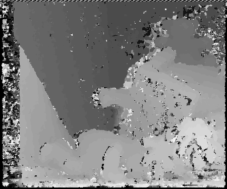
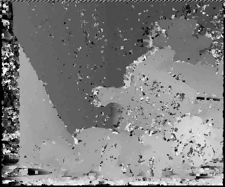

stereo matching 
==========
Simple CPU implementation from sratch of Block Matching using simple Sum of Square difference, rank transform and census transform as matching cost. Defualt use OpenMP optimization, also have the option to use OpenCV parallel computing  
You can either compile the code to executable with gcc or visual studio with Opencv installed. This have been tested in Windows 10.    

left image:  
  
right image:  
  
disparity image with fixed windows ssd:  
  
disparity image with rank transform:  
  
disparity image with census transform:  
  

Clearly, choosing rank transform or census transform as matching cost make disparity map less noisy, probably the nature of these transform make left and right images less sensitive to illumination changes.  

---
## Reqirement 

    $OPENCV

**Usage**

    ./stereo_mathing -left=<left image> -right=<right image> -max-disparity=<disparity range> -window_size=<window size for block matching> -tranwin_size=<window size for transformation> -output=<output image file> -parallel=<if you want to run parallel version> -cost=<matching cost function ex: rank or census>

**Examples**

    ./stereo_matching -left=im1.png -right=im2.png -max-disparity=50 -window_size=6 -tranwin_size=7 -output=depth_new.png -parallel=no -cost=rank

