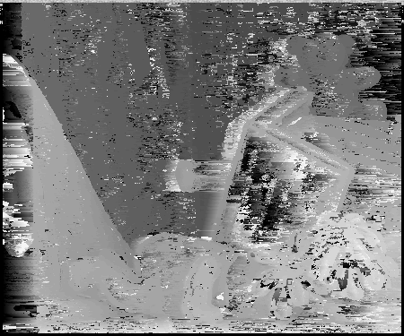

stereo matching 
==========

Simple CPU implementation from sratch of Block Matching using simple Sum of Square difference Matching Cost  
left image:  
  
right image:  
  
disparity image:  

---
## Reqirement 

    $OPENCV

**Usage**

    ./stereo_mathing -left=<left image> -right=<right image> -max-disparity=<disparity range> -output=<output image file> 

**Examples**

    ./stereo_matching -left=im1.png -right=im2.png -max-disparity=50 -output=depth.png 

